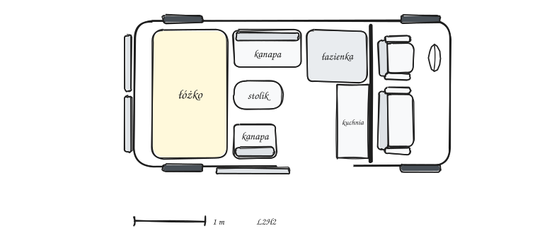
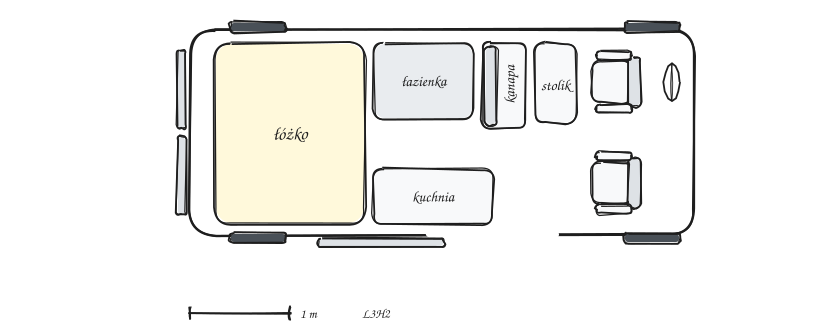
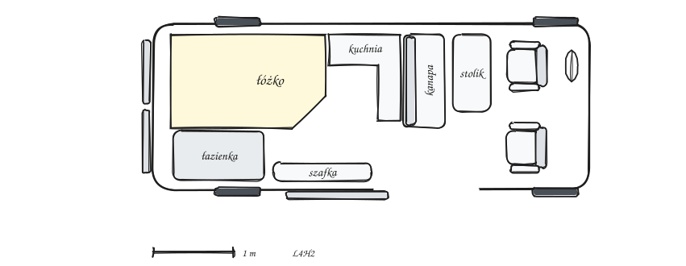
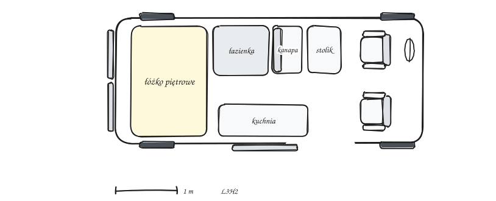
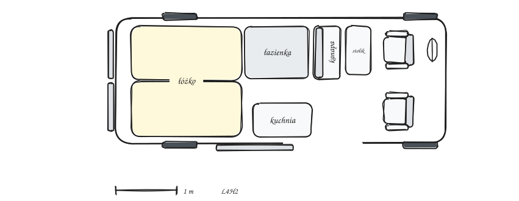
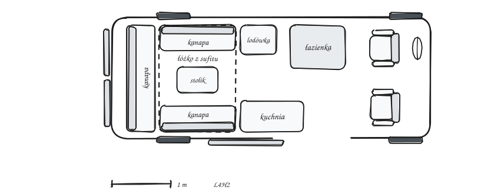
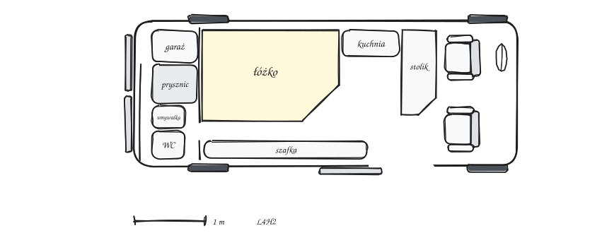
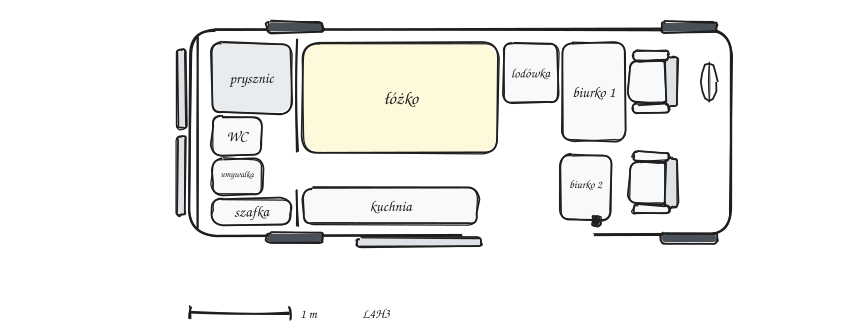

# Układ wnętrza

Większość z nas, projektując wnętrze kampera, zastanawia się nad jednym: „jak to wszystko zmieścić, żeby dało się jeszcze przejść?” :)|

Chciałbym Wam zaproponować inne pytanie: „czy w tym wnętrzu będzie czuć przestrzeń”.

Przy mieszkaniu na stałe, z dużym prawdopodobieństwem, będziecie spędzać w środku większość czasu w robocze. Zdarzają się też całe tygodnie deszczu, kiedy z kampera praktycznie się nie wychodzi mimo chęci. Dlatego uważam, że Warto się zastanowić nad tym, żebyśmy w naszym kamperze nie czuli się jak w klatce otoczeni szafkami ze wszystkich stron bez przestrzeni, żeby się przeciągnąć. Wiem, że kolejna szafka i kolejny sprzęt zazwyczaj wygrywają z poczuciem przestrzeni, i nie każdemu jego brak przeszkadza, ale uważam, że przynajmniej warto to wziąć pod uwagę i być tego świadomym przy projektowaniu.

W kampervanach zbudowanych na popularnych bazach, czyli autach ze względnie krótkim i wąskim wnętrzem, najbardziej na poczucie przestrzeni wpływa układ wnętrza. Zaryzykuję wręcz stwierdzenie, że układ ma większy wpływ na poczucie przestrzeni niż wybrana wersja długości nadwozia! Planując, najczęściej używamy rzutu z góry i w takiej perspektywie kompletnie nie widać tego, co najbardziej zaburza poczucie przestrzeni w środku, czyli tego, czy zabudowa staje na linii wzroku!

Klasyczny układ — z łazienką na środku — dzieli optycznie auto na pół. W pierwszej wersji mieliśmy mniej więcej w tym miejscu słupek kuchenny z lodówką, piekarnikiem i zmywarką od góry do dołu. Słupek był węższy od przeciętnej kamperowej łazienki, a mimo tego dzielił kampera na „kącik do pracy” i „kącik do spania”.
W aktualnej wersji słupek wyleciał. Łazienka od zawsze zajmowała cały tył i stoi za ścianą, więc Patrząc, ma się wrażenie, że na tej ścianie kończy się kamper, a wchodząc za jej drzwi, dostajemy kolejne mini pomieszczenie. Dzięki temu, że nie mamy ściany grodziowej, wchodząc do kampera jest przestrzeń zarówno na lewo aż do ściany łazienki, jak i na prawo do szoferki. Jest to przestrzeń na całą szerokość i z dowolnego miejsca części mieszkalnej widać każdy jej zakątek. Oczywiście z wyłączeniem łazienki.

Trzeba otwarcie przyznać, że ten układ wyszedł nam trochę z przymusu, a nie z chęci, bo właśnie planowaliśmy mieć osobny „kącik do pracy” i „do spania” przedzielony tym słupkiem :) Mimo tego wyszło coś naprawdę fajnego, czego się kompletnie nie spodziewaliśmy, przez co nasz kamper prezentuje się zupełnie inaczej niż większość zabudów.

## Układy jakie warto znać

Zebrałem tu układy, które powtarzają się w większości zabudów fabrycznych i często też samodzielnych. Przy każdym z tych układów postarałem się zebrać jego plusy i minusy, ale oczywiście są to tylko i wyłącznie moje opinie.

Warto pójść sprawdzony standardowy układ, jeśli zależy Wam na minimalizacji ilości potencjalnych błędów.
Taką poradę znajdziecie w większości książek i poradników dotyczących budowy własnego kampervana i ja z tą opinią się zgadzam. Z drugiej strony chcę Was trochę zachęcić do eksperymentowania :) To przecież właśnie po to budujemy własnymi rękoma, żeby móc zrobić taki układ, jak pasuje nam. W takich układach na pewno popełnimy błędy. Prawie na pewno po wybudowaniu tego układu będziecie chcieli go poprawić albo, co gorsza, rozebrać i zbudować od nowa, ale uważam, że w tym tkwi piękno własnych konstrukcji. Nie bójcie się eksperymentować! Jednak zróbcie to z głową, żebyście nie musieli rozbierać Waszego układu jeszcze przed pierwszymi podróżami tak jak my.

Warto też zaznaczyć, że mniej standardowe układy będzie prawdopodobnie też trudniej odsprzedać, jeśli kiedykolwiek mielibyście myśleć o sprzedaży Waszego kampera. Samoróbki same z siebie bardzo tracą na wartości, a niestandardowy układ jeszcze bardziej utrudni sprzedaż za rozsądne pieniądze :/

### Decyzje, które definiują układ

Cztery decyzje trzeba podjąć wcześniej, bo one skreślają część układów, zanim zaczniecie je porównywać.

- **Ściana grodziowa** Ze ścianą szoferka jest osobnym pomieszczeniem. Dodatkowa ściana zaraz po prawej stronie, wchodząc do strefy mieszkalnej przez przesuwane drzwi, daje też możliwości aranżacji w tym miejscu łazienki bądź kuchni. Dzięki temu, patrząc na lewo od wejścia, widzimy więcej otwartej przestrzeni i mamy więcej ścian do postawienia szafek. Największym minusem jest to, że nie możecie używać foteli z szoferki do pracy czy jedzenia. Bez ściany dostajecie przejście, fotele obrotowe jako jadalnię i możliwość montażu drugiego rzędu siedzeń.
- **Wakacje czy mieszkanie.** W takim trybie najczęściej nie będzie nam przeszkadzać brak przejścia pomiędzy szoferką a strefą mieszkalną, jeśli zdecydujemy się na ścianę grodziową. Tak naprawdę to przeszkadza tylko, kiedy jest bardzo zimno albo kiedy pada i koniecznie trzeba jechać. Jak nie ma miejsca, to w wakacyjnym trybie łóżko może być rozkładane, a prysznic można zrobić za pomocą kotary albo na zewnątrz.
- **Długość i wysokość bazy.** L2 to wszystko na wcisk i często brak łazienki, L4 powinien pomieścić wszystko nawet dla 4 osób. Szerokość decyduje o łóżku w poprzek: w Ducato da się je wyciągnąć do około 190 cm, Sprinter i Crafter są węższe i zwykle potrzebują poszerzeń. Wysokość powinniśmy dopasować do wzrostu.
- **Ile osób jedzie, ile śpi.** Dwie osoby zmieszczą się w każdym układzie. Jeśli chodzi o większą ilość, to nie tylko potrzeba demontować tylny rząd siedzeń, ale zastanowić się, gdzie te osoby będą spały i tu najczęściej robi się już ciasno. Jeśli chcecie jeździć we dwoje, ale wolelibyście mieć tylną kanapę — istnieje pewien kompromis: zrobienie tylko dwóch miejsc do spania. W takim układzie pasażerowie z tylnej kanapy będą musieli zabrać ze sobą namiot na podróż z Wami, ale jeśli zazwyczaj jeździcie bez nich, to nie musicie wozić ze sobą dodatkowego łóżka i poświęcać na niego miejsca.

### Układy ze ścianą grodziową

Wszystkie układy z tej grupy mają wspólny punkt wyjścia: fabryczna ściana zostaje, szoferka jest osobnym pomieszczeniem tylko do jeżdżenia, a do części mieszkalnej wchodzicie drzwiami przesuwnymi.
Różnice między układami sprowadzają się do tego, co stoi przy tej ścianie i co jest z tyłu. Najczęściej przy ścianie stoi łazienka, obok niej kuchnia, przy wejściu siedzisko ze stolikiem, a cały tył zajmuje stałe łóżko w poprzek z bagażnikiem pod spodem. Czasem zamiast stałego łóżka tył bywa salonem z dwiema kanapami i stołem, który na noc opuszcza się do poziomu siedzisk.

Seryjnie prawie nikt tak nie buduje, to układ samoróbek i małych zabudowców. Wyjątkiem jest Freedo, marka córka polskiego producenta Affinity, pod którą powstają tańsze kampery, układem przypominające właśnie samoróbki.

Za przykład do rysunku bierzemy więc: Freedo 541 HT — ma ścianę, kuchnię w poprzek tuż przy niej, łazienkę obok, z tyłu stałe łóżko, pod którym jest garaż.

**Dla kogo:**

- dwie osoby, maksymalnie trzy;
- na wakacje lub przy mieszkaniu na stałe jako wariant budżetowy.

**Plusy:**

- Bez formalności zmiany konstrukcyjnej;
- bez wykańczania szoferki;
- wysoka zabudowa stoi na samym początku strefy mieszkalnej, więc reszta zostaje jedną otwartą przestrzenią.

**Minusy:**

- brak przejścia do szoferki (problem zimą i w deszczu);
- ściana zjada kilka do kilkunastu centymetrów długości;
- fotele nie mogą służyć jako jadalnia czy miejsce do pracy.

### Układy bez ściany grodziowej

Bez ściany fotele z szoferki obracają się do środka i pracują jako jadalnia i/lub miejsce do pracy, a układy różnią się głównie tym, gdzie stoi łazienka i w którą stronę zamontowane jest łóżko.

#### Łazienka na środku, drugi rząd, łóżko w poprzek nad garażem

To najpopularniejszy układ fabrycznych kampervanów. Otwarta szoferka z fotelami obrotowymi, za nimi stolik i drugi rząd, czyli kanapa do jazdy, która na noc rozkłada się w dodatkowe spanie. Dalej, na środku długości auta, przy lewej ścianie stoi kabina z prysznicem i toaletą, a naprzeciwko kuchnia. Z tyłu łóżko zamontowane jest w poprzek, a pod nim garaż z dostępem tylnymi drzwiami oraz od wewnątrz.

Za przykład do rysunku bierzemy Sunlight Cliff 600 na Boxerze o długości 599 cm: łazienka na środku po lewej stronie, kuchnia z lodówką po drugiej, łóżko poprzeczne nad garażem, cztery miejsca do jazdy i dwa do spania plus jedno rozkładane. To ten sam Cliff, który w wersji 4x4 na Transicie wspominałem przy wyborze bazy :)

**Dla kogo:**

- rodzina albo dwie osoby;
- wakacje i dłuższe wyjazdy.

**Plusy:**

- sypialnia jest wydzielona, więc jedna osoba pracuje z przodu, a druga już śpi;
- drugi rząd do jazdy;
- duży garaż, który — jeśli łóżko jest wystarczająco wysoko — zmieści nawet na rowery;
- wielu zabudowców uważa go za funkcjonalnie najlepszy układ.

**Minusy:**

- kabina na środku dzieli wnętrze na dwie mniejsze części; w długim aucie przeszkadza to mniej, w krótkim wszystko jest na wcisk;
- łóżko w poprzek nie przekroczy szerokości auta, więc osoby powyżej około 185 cm wzrostu potrzebują poszerzeń.

#### Łóżko francuskie, łazienka w rogu tyłu

Otwarta szoferka z fotelami obrotowymi i stolik, za nimi zwykle drugi rząd, a kuchnia stoi tam, gdzie zostaje miejsce: z boku albo w poprzek, tuż za tylną ławą, jak w Affinity One. Wysokie szafy i łazienka stoją na samym końcu auta. Łóżko francuskie, czyli nie na całą szerokość auta, leży wzdłuż przy jednej ścianie, a w wąskim aucie bywa wyginane i poszerzane. Łazienka zajmuje róg tyłu, tylko część szerokości, a reszta tyłu pracuje jako bagażnik z dostępem od tylnych drzwi.

Za przykład do rysunku bierzemy Affinity One, cztery miejsca do jazdy i również cztery do spania. Mieszkałem w nim prawie miesiąc, więc ten układ znam od środka. Zbliżonym do tego układu seryjnym kamperem jest również Globe-Traveller Explorer XS.

**Dla kogo:**

- dwie, trzy, czasem nawet cztery osoby;
- wakacje i mieszkanie.

**Plusy:**

- otwarta, przestronna część dzienna, bo na środku nie ma wielkiej szafy;
- garaż pod łóżkiem nadal dostępny.

**Minusy:**

- garaż jest mniejszy niż przy łóżku w poprzek;
- łóżko francuskie zwęża się w nogach.

##### Problem z czterema miejscami do spania

W obu układach, zarówno z łazienką na środku, jak i z tyłu w rogu, trzecie i czwarte miejsce do spania jest rozkładane z siedzisk tylnej kanapy. Takie łóżka są zazwyczaj wąskie a czasem również krótkie. Nadają się dla dwojga dzieci, niekoniecznie dla dwojga dorosłych. Duża część producentów wręcz opisuje je jako łóżka dla jednej osoby, a nie dwóch.
Jedyne rozwiązanie, jakie znam, które naprawdę mieści dwóch dorosłych na raz, ma kampervan Affinity One. Tam kanapa rozkłada się w łóżko piętrowe! To niestety ich opatentowany mechanizm, robiony tylko dla nich przez firmę Mobiframe, więc nie kupicie go osobno ani łatwo nie skopiujecie. Mimo to warto go obejrzeć w katalogu producenta albo na żywo, bo to naprawdę przemyślane rozwiązanie: korzystałem z niego na żywo, więc to wiedza z pierwszej ręki :)

Niektórzy producenci rozwiązują ten problem podnoszonym dachem. Fragment dachu na postoju unosi się do góry, ręcznie albo siłownikami elektrycznymi. Pod uniesioną częścią rozpina się materiałowa ściana, podobna do tej w namiocie, a na wysokości sufitu leży materac, na którym komfortowo śpią dwie osoby. Brzmi świetnie, ale nie jest to rozwiązanie idealne. Po pierwsze jest drogi. Po drugie zabiera miejsce, a nie na każdym podnoszonym dachu można zamontować panele. Okna dachowe też raczej odpadają. Po trzecie przy silnym wietrze podnoszony dach trzeba złożyć: materiałowe ściany łopoczą tak, że nie da się spać, a przy porywach mogą się po prostu uszkodzić. Na pewno bardzo fajnie sprawdza się, kiedy od czasu do czasu chcecie zabrać znajomych albo rodzinę, ale nie może być traktowany jako miejsce do spania, które zawsze będzie dostępne.

#### Łóżka piętrowe z tyłu plus łóżko z jadalni

W takim układzie obniżamy tylne poprzeczne łóżko kosztem przestrzeni bagażowej poniżej i tworzymy nad nim kolejny poziom, tworząc łóżko piętrowe.

Za przykład do rysunku bierzemy Dethleffs Globetrail Active 600 KS, kampervan z największą liczbą miejsc do spania, jaką w życiu widziałem. W standardzie ma z tyłu dwa poprzeczne łóżka jedno nad drugim, razem cztery miejsca do spania. Do tego można dobrać dwie opcje: podnoszony dach (+2 osoby) i łóżko rozkładane z przedniej kanapy (+1 osoba). Można więc policzyć, że ten kampervan jest teoretycznie w stanie przenocować aż siedem osób naraz, mimo że jechać nim mogą „tylko” cztery :)

**Dla kogo:**

- rodzina z dziećmi,
- na stałe i na wakacje.

**Plusy:**

- stałe spanie dla wszystkich, bez rozkładania.

**Minusy:**

- garaż praktycznie znika — dolne łóżko musi zejść tak nisko, że pod nim zostaje 30–40 cm na zbiorniki;
- nad materacem w układzie piętrowym zostaje około 60 cm, więc jest ciasno, trochę jak w kuszetce w pociągu;
- zanim zdecydujecie się na piętra, sprawdźcie, gdzie zmieścicie Wasze bagaże.

#### Dwa pojedyncze łóżka wzdłuż ścian, łączone

Przód taki sam jak w dwóch poprzednich, łazienka na środku, a z tyłu łóżko leżące wzdłuż auta. Będąc bardziej precyzyjnym, to są najczęściej dwa łóżka, ustawione wzdłuż obok siebie, tworzące jedno większe. Cały sens tego układu jest jednak w tym, że każde z łóżek osobno da się podnieść do pionu wzdłuż dłuższej krawędzi, tak że stoi wzdłuż swojej ściany. Wtedy od tylnych drzwi w głąb auta otwiera się przejście na całą wysokość, a do środka wjeżdżają rowery, deski, narty albo cokolwiek, co nie zmieści się pod łóżkiem.

Za przykład do rysunku bierzemy Carado CV640: łóżko wzdłuż, łazienka na środku i cztery miejsca do jazdy.

**Dla kogo:**

- osoby wyższe, niż pozwala szerokość auta: 185 cm i więcej;
- pary, które wolą dwa osobne materace;

**Plusy:**

- długości łóżka nie ogranicza szerokość auta;
- każda osoba wchodzi do łóżka od nóg i nikt nie przeskakuje przez partnera;
- po podniesieniu łóżek auto otwiera się na przestrzał i może wozić długie i wysokie rzeczy;

**Minusy:**

- stałe łóżko wzdłuż zjada 190–200 cm długości auta, a w poprzek tylko około 120 cm, dlatego ten układ potrzebuje długiej bazy i zostawia mało miejsca poza łóżkiem.

#### Łóżko opuszczane z sufitu

Nad strefą dzienną albo nad tyłem wisi łóżko podnoszone pod sufit. W dzień pod nim jest normalna przestrzeń, salon albo garaż, a na noc łóżko opada i opiera się na zabudowie. Mechanizm to gotowy system albo własna konstrukcja na silniku rurowym, takim jak do rolet, i moim zdaniem to bardzo trudna rzecz do zrobienia samemu.

Za przykład do rysunku bierzemy Bürstner Eliseo C 644: salon w kształcie U z tyłu, nad nim opuszczane łóżko i cztery miejsca do jazdy.

**Dla kogo:**

- mieszkanie na stałe;

**Plusy:**

- pełnowymiarowa sypialnia, która na dzień znika.

**Minusy:**

- wymaga wysokiego wnętrza;
- trzeba ufać mechanizmowi i pilnować udźwigu silnika;
- skomplikowana konstrukcja;
- wymagana dodatkowa rama wzmacniająca konstrukcję samochodu;
- jeśli jedna osoba chce korzystać z salonu, a druga z łóżka, to naraz nie ma takiej możliwości.

#### Otwarty przód bez przeróbki szoferki

W praktycznie każdym z powyższych układów można też zostawić fabryczne fotele: kierowca plus ława pasażera albo ława zamieniona na pojedynczy fotel. Ściana grodziowa nadal wylatuje, więc do środka wchodzi więcej światła, przestrzeń jest otwarta. Przejście z szoferki do części mieszkalnej jest możliwe, choć mniej wygodne. Inwestycja w szoferkę jest mała albo zerowa, bo nie kupujecie obrotnic ani nowych foteli z homologacją.

Minus jest jeden: fotele bez obrotnic nie będą miejscem siedzącym przy stole ani miejscem do pracy, więc trzeba pomyśleć o dodatkowej ławie/siedzeniach z tyłu. Na szczęście, jeśli taka ława nie służy do jazdy, możecie ją wykonać w dowolny sposób i nie potrzebujecie żadnych elementów z homologacją.

### Układy z zamkniętym tyłem

Otwarta szoferka, strefa dzienna i kuchnia, dalej łóżko, a cały tył to zamknięta łazienka na pełną szerokość auta.

 Do łazienki wchodzi się przejściem od strony sypialni, a od tylnych drzwi jest ściana.

Łóżko wcale nie musi być szersze niż w innych układach, bo dzieli szerokość auta z przejściem do łazienki i z szafkami albo kuchnią wzdłuż ściany. Za to na noc może się rozsunąć i zająć przestrzeń, która w dzień służy za korytarz, więc w dzień macie przejście, a w nocy szerokie łóżko.

Za przykład do rysunku bierzemy Affinity Duo, łóżko wzdłuż przed łazienką, rozsuwane na noc, osobny prysznic i dwa miejsca do jazdy.

**Dla kogo:**

- dwie osoby;
- mieszkanie na stałe.

**Plusy:**

- łazienka z prysznicem, toaletą i umywalką osobno;
- szersze łóżko;
- wnętrze zostaje otwarte, bez szafy na środku.

**Minusy:**

- zero garażu, a duża część miejsca pod łóżkiem będzie zajęta przez zbiorniki, akumulatory czy bojler na wodę;
- tylne drzwi przestają być drzwiami do wnętrza, więc każdy bagaż wchodzi bocznymi
- brak widoku przez otwarty tył;
- łazienka na całą szerokość zjada około 80 cm długości paki, więc układ wymaga długiego auta.

#### Nasz układ

Nasz układ to odmiana tego samego pomysłu, w Peugeocie Boxerze L4H3. Od przodu: otwarta szoferka bez ściany grodziowej i dwa pojedyncze fotele obrotowe. Dwa biurka: moje, zamontowane na szynie wzdłuż ściany i Weroniki, na jachtowym ramieniu Lagun, po stronie drzwi przesuwnych. Za moim biurkiem stoi lodówka. Łóżko leży wzdłuż lewej ściany, ma około 190 cm na 110 cm. Pod spodem siedzi zbiornik na wodę szarą, boiler, akumulatory i część bagażu. Obok łóżka biegnie przejście do łazienki. Kuchnia stoi wzdłuż prawej ściany. Łazienka zajmuje cały tył: prysznic 75 na 50 cm od lewej ściany, toaleta na środku z umywalką od prawej, plus mała tego szafka. Za łazienką jest stała pełna ściana, bez wejścia od tylnych drzwi.

Ten układ ma dla nas naprawdę sporo zalet. Cztery strefy: czyli spanie, łazienka, praca i kuchnia, są dostępne bez przestawiania czegokolwiek poza obróceniem foteli! Mało tego, z bezwzględnie każdej z nich da się korzystać, gdy druga osoba korzysta z innej. Nic niczego nie blokuje.

Dzięki naprawdę dużej otwartej przestrzeni w kamperze swobodnie da się przeciągnąć i można „oddychać” i nie oszaleć nawet podczas długich, deszczowych dni, po prostu dni roboczych w pracy :)

Nawiązując do deszczowych dni: w takie dni i tak musimy wychodzić na spacery z psami, i wszystkie zamoknięte ubrania mogą swobodnie suszyć się pod prysznicem. Toaleta jest obok, więc nadal da się z niej swobodnie korzystać!

Z dużych minusów tego układu jest kompletny brak garażu. Pomiędzy tylnymi drzwiami a tylną ścianą łazienki mieszczą się krzesełka kempingowe, stolik, szpula z przedłużaczem, wąż do nalewania wody i trochę bagażu. Nie mamy niestety najmniejszych szans przenieść rowerów. Nie wejdzie nam nawet hulajnoga. Jeśli chcemy wejść ze sobą trapy, bo planujemy jeździć na przykład po lesie, albo jedziemy w zimie na deskę i chcemy wziąć ze sobą snowboard, musimy zrezygnować na przykład z więzienia stołu.

Poza tym nasze łóżko, w przeciwieństwie do Affinity, nie rozsuwa się na szerokość przejścia i to jest jedna z rzeczy, które zdecydowanie musimy poprawić, ponieważ tak na dobrą sprawę wystarczy zamienić stały stelaż na rozsuwany stelaż. Dzięki temu łóżko zamiast 110 cm szerokości będzie miało 140 m i będzie wielkości standardowego małego domowego łóżka.

### Jak z tego wybrać układ dla siebie?

Nie zakładam, że po przeczytaniu katalogu wiecie już, czy chcecie ścianę grodziową, czy nie, albo czy łazienka na środku będzie Wam przeszkadzać zmniejszając przestronność wnętrza. Tego nie da się rozstrzygnąć na kartce, trzeba to zrobić osobiście :) Najtańszy sposób to targi: stoi tam kilkaset gotowych kamperów w każdym układzie z tego katalogu. Do większości można wejść. Weźcie miarkę i mierzcie przejścia, wysokość nad łóżkiem i szerokość między szafkami. Sprawdźcie, czy mieścicie się w danym układzie razem — na przykład, kiedy druga osoba stoi przy kuchni a druga chce przejść do toalety. Ze ścianą i bez ściany obejrzyjcie tego samego dnia, jedno po drugim, bo dopiero w porównaniu widać, co Wam przeszkadza.

Jeszcze lepszy sposób to wynająć kamper w układzie, który Was kusi, na tydzień: po kilku nocach wiecie, ile razy dziennie coś przestawiacie i czy Was to wkurza.

Cztery pytania z początku rozdziału znajdą po takich testach odpowiedzi same :)
